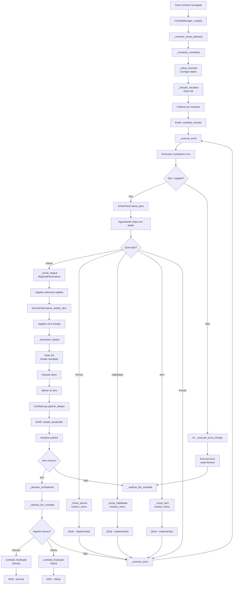

# 🗺️ Arquitetura Visual do Sistema de Combate

## Diagrama de Nós - Combat.tscn

```
Control (%Root)
├── script: CombatManager.gd
│
└── MarginContainer
    └── VBoxContainer (MainLayout)
        │
        ├── [1] TopBar (PanelContainer) [40px height]
        │   └── HBoxContainer (TopBarLayout)
        │       │
        │       ├── [2] PartyPanel (PanelContainer) [180px width]
        │       │   ├── script: party_panel.gd
        │       │   ├── unique_name: %PartyPanel
        │       │   └── Contém: Personagens + HP + Estresse + Status
        │       │
        │       ├── [3] Battlefield (Control) [3x flex ratio]
        │       │   ├── unique_name: %Battlefield
        │       │   └── Grid visual de combate
        │       │
        │       ├── [4] EnemyPanel (PanelContainer) [180px width]
        │       │   ├── script: enemy_panel.gd
        │       │   ├── unique_name: %EnemyPanel
        │       │   └── Contém: Inimigos + HP + Seletor
        │       │
        │       └── [5] VBoxContainer (RightPanel)
        │           │
        │           ├── RegionalPanel (PanelContainer) [250px, 2x flex ratio]
        │           │   ├── script: regional_selector.gd
        │           │   ├── unique_name: %RegionalPanel
        │           │   ├── Inicialmente: HIDDEN (hide())
        │           │   └── Contém: 5 botões de regiões + confirmar/cancelar
        │           │
        │           └── ActionPanel (PanelContainer) [flex]
        │               ├── script: action_panel.gd
        │               ├── unique_name: %ActionPanel
        │               └── Contém: 4 botões de ação + passar turno
        │
        └── [6] LogPanel (PanelContainer) [120px height]
            ├── script: combat_log.gd
            ├── unique_name: %LogPanel
            ├── type: RichTextLabel
            ├── bbcode_enabled: true
            ├── scroll_following: true
            └── Contém: Histórico colorido de eventos
```

---

## Layout Visual Durante Combate

```
┌─────────────────────────────────────────────────────────────────┐
│  GUERREIRO          [BATTLEFIELD]           GOBLIN              │
│  HP: 15/15          [       O       ]       HP: 8/10            │
│  Estresse: 2        [    Combat     ]       HP: ████░░░░░░      │
│  [Status]           [    Field      ]       [Click to Select]   │
│                                                                   │
│  ┌─────────────────────────┬────────────────────────────────┐   │
│  │ Selecione Regiões:      │ ⚔️  ATACAR                    │   │
│  │ [ ] Torso               │ ✨ PERÍCIA                    │   │
│  │ [ ] Braço Direito       │ 💥 HABILIDADE                │   │
│  │ [ ] Braço Esquerdo      │ 🎒 ITEM                      │   │
│  │ [ ] Perna Direita       │                               │   │
│  │ [ ] Perna Esquerda      │ ➡️  PASSAR TURNO             │   │
│  │                         │                               │   │
│  │ [✓ Confirmar] [✗ Canc]  │                               │   │
│  └─────────────────────────┴────────────────────────────────┘   │
│                                                                   │
├──────────────────────────────────────────────────────────────────┤
│ 🎯 Turno de Guerreiro!                                          │
│ ⚔️ Guerreiro atacou Goblin (Torso) - Dado: 5                    │
│   → DANO: 2                                                      │
│   → ESTRESSE: +1                                                │
│ ➡️ Goblin ficou sem pontos de ação!                            │
└──────────────────────────────────────────────────────────────────┘
```

---

## Estados da UI

### Estado 1: Esperando Ação do Jogador

```
✓ PartyPanel: VISÍVEL (jogador em turno destacado)
✓ EnemyPanel: VISÍVEL (inimigos normais)
✓ ActionPanel: HABILITADO (botões clicáveis)
✓ RegionalPanel: OCULTO (hide())
✓ Battlefield: VISÍVEL (decorativo por enquanto)
✓ LogPanel: VISÍVEL (histórico)
```

### Estado 2: Selecionando Regiões

```
✓ PartyPanel: VISÍVEL (dimmed)
✓ EnemyPanel: VISÍVEL (dimmed)
✓ ActionPanel: DESABILITADO (botões inativos)
✓ RegionalPanel: VISÍVEL (show()) - modo "selecionar_ataque"
✓ Battlefield: VISÍVEL (opcional: highlight regiões)
✓ LogPanel: VISÍVEL
```

### Estado 3: Selecionando Alvo

```
✓ PartyPanel: VISÍVEL
✓ EnemyPanel: VISÍVEL + MODO SELETOR ATIVO (botões clicáveis)
✓ ActionPanel: DESABILITADO
✓ RegionalPanel: VISÍVEL (regiões confirmadas, label: "Selecione alvo")
✓ Battlefield: VISÍVEL (opcional: highlight inimigo alvo)
✓ LogPanel: VISÍVEL
```

### Estado 4: Processando Ataque

```
✓ PartyPanel: VISÍVEL
✓ EnemyPanel: VISÍVEL + MODO SELETOR INATIVO
✓ ActionPanel: DESABILITADO
✓ RegionalPanel: OCULTO (hide())
✓ Battlefield: VISÍVEL (opcional: animação de ataque)
✓ LogPanel: VISÍVEL (registrando resultado)
```

---

## Fluxo de Estados

```
START
  │
  ├─→ INICIALIZANDO
  │   ├─ Carregar dados de combate
  │   ├─ Calcular iniciativa
  │   ├─ Atualizar PartyPanel + EnemyPanel
  │   ├─ Emitir: combate_iniciado
  │   └─ Ir para: TURNO_PROXIMO
  │
  ├─→ TURNO_PROXIMO
  │   ├─ Encontrar combatente vivo
  │   ├─ Emitir: turno_iniciado(combatente)
  │   │  └─ ActionPanel.ativar_para(combatente)
  │   │  └─ PartyPanel.indicar_personagem_ativo(combatente)
  │   └─ Ir para: AGUARDANDO_ACAO
  │
  ├─→ AGUARDANDO_ACAO
  │   ├─ [Jogador pressiona botão]
  │   │  ├─ ATACAR → SELECIONANDO_REGIOES
  │   │  ├─ PERICIA → MENU_PERICIAS (stub)
  │   │  ├─ HABILIDADE → MENU_HABILIDADES (stub)
  │   │  ├─ ITEM → MENU_ITENS (stub)
  │   │  └─ PASSAR → TURNO_PROXIMO
  │   │
  │   └─ [IA escolhe ação se inimigo]
  │       └─ EXECUTANDO_ACAO
  │
  ├─→ SELECIONANDO_REGIOES
  │   ├─ RegionalPanel.ativar_para_ataque()
  │   ├─ [Jogador seleciona 1-3 regiões]
  │   │  └─ RegionalSelector emite: regiao_selecionada
  │   │
  │   └─ [Jogador confirma]
  │       └─ Ir para: SELECIONANDO_ALVO
  │
  ├─→ SELECIONANDO_ALVO
  │   ├─ EnemyPanel.ativar_seletor_alvo()
  │   ├─ [Jogador clica em inimigo]
  │   │  └─ EnemyPanel emite: inimigo_selecionado
  │   │
  │   └─ Ir para: PROCESSANDO_ATAQUE
  │
  ├─→ PROCESSANDO_ATAQUE
  │   ├─ Rolar D6 (uma por região)
  │   ├─ Avaliar categoria (extremo/regular/falha/crítica)
  │   ├─ Calcular dano
  │   ├─ Aplicar dano/estresse ao alvo
  │   ├─ CombatLog.registrar_ataque(resultado)
  │   ├─ Emitir: estado_atualizado
  │   │  └─ Atualizar painéis
  │   │
  │   └─ Se alvo morreu: DERROTADO
  │       Senão: TURNO_PROXIMO
  │
  ├─→ VERIFICANDO_FIM_COMBATE
  │   ├─ Se jogadores == 0 → DERROTA
  │   ├─ Se inimigos == 0 → VITORIA
  │   └─ Senão → TURNO_PROXIMO
  │
  ├─→ DERROTA
  │   ├─ Log: "⚠️ COMBATE FINALIZADO: Derrota"
  │   ├─ Emitir: combate_finalizado("Derrota")
  │   └─ END
  │
  └─→ VITORIA
      ├─ Log: "⚠️ COMBATE FINALIZADO: Vitória"
      ├─ Emitir: combate_finalizado("Vitória")
      └─ END
```

---

## Mapeamento de Cores do Log

```
🎯 TURNO (gold)          - Turno iniciado
⚔️  ACAO (lightyellow)   - Ação executada
ℹ️  INFO (white)          - Informação geral
✓ SUCESSO (lime)         - Ação bem-sucedida
⚠️  AVISO (orange)       - Aviso importante
✗ CRITICO (red)          - Evento crítico
🚶 MOVIMENTO (lightblue) - Deslocamento

Resultados D6:
✓✓ SUCESSO EXTREMO (lime)   - 6
✓ SUCESSO REGULAR (yellow)   - 4-5
✗ FALHA REGULAR (orange)     - 2-3
✗✗ FALHA CRÍTICA (red)      - 1
```

---

## Estrutura de Dados de Combatente

```
{
  "nome": String,              # "Guerreiro"
  "tipo": String,              # "jogador" ou "inimigo"
  
  # Saúde
  "saude_maxima": int,         # 15
  "saude_atual": int,          # 15
  
  # Defesa
  "defesa_base": int,          # 2
  
  # Ataque
  "dano_arma": int,            # 2
  "atributo_dano": int,        # 1
  
  # Estresse por região (CRÍTICO PARA OBLIVIO)
  "estresse_por_regiao": {
    "Torso": int,              # 0
    "Braço Direito": int,      # 0
    "Braço Esquerdo": int,     # 0
    "Perna Direita": int,      # 0
    "Perna Esquerda": int      # 0
  },
  
  # Status ativos
  "status": [{                 # []
    "nome": String,            # "Defesa Reforçada"
    "duracao": int             # 1
  }],
  
  # Turno (calculado)
  "iniciativa": int            # 5
}
```

---

## Integração com Diálogos (Autoload)

```
CombatManager
  │
  └─→ Dialogos (Autoload)
      ├─ Dialogos.personagem_jogador
      │  └─ Dados do personagem
      │
      └─ Dialogos.[outros dados]
```

Acesso em CombatManager:
```gdscript
func _inicializar_combate() -> void:
    var nome = Dialogos.personagem_jogador["nome"]
    var saude = Dialogos.personagem_jogador["vida"]
    # etc...
```

---

## Fluxograma Completo



---

## Checklist de Implementação

```
ESTRUTURA:
  ☑ Criar nós conforme diagrama
  ☑ Atribuir scripts aos nós
  ☑ Marcar com unique_name (%)
  ☑ Configurar custom_minimum_size

SCRIPTS:
  ☑ CombatManager.gd
  ☑ ActionPanel.gd
  ☑ RegionalSelector.gd
  ☑ EnemyPanel.gd
  ☑ PartyPanel.gd
  ☑ CombatLog.gd

DADOS:
  ☑ Carregar combatentes em _setup_exemplo()
  ☑ Ou carregar de Dialogos (autoload)
  ☑ Calcular iniciativa
  ☑ Criar ordem de turno

TESTES:
  ☑ Play scene (F5)
  ☑ Verificar se CombatManager inicia
  ☑ Verificar se painéis atualizam
  ☑ Testar fluxo: Atacar → Regiões → Alvo → Resultado
  ☑ Verificar se log registra eventos
  ☑ Testar fim de combate
```
